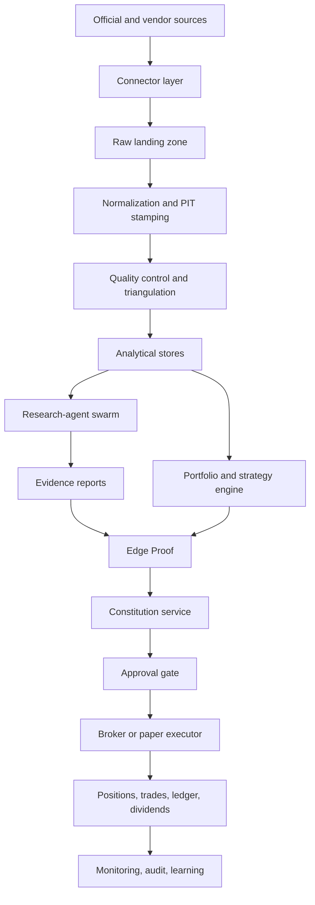

# Scalable Portfolio, Data, and Research Architecture for The Camel

**Date:** June 6, 2026  
**Scope:** portfolio-and-strategy engine, dividend handling, data sourcing, research-agent swarm, execution models, governance, scaling, and implementation roadmap for a Sharia-compliant autonomous investment OS.

## Executive summary

The Camel already appears to have the right *governance spine* for a serious autonomous investment system: an external Constitution, Edge Proof gating, approval controls before live money, a kill switch, audit logs, and a Phase-0 paper-trading architecture centered on seven domain databases and point-in-time data discipline. That is a stronger starting point than many trading systems, and it means the next bottleneck is **not** “more AI autonomy.” The next bottleneck is a **deterministic portfolio state model** backed by **point-in-time data**, **realistic simulation**, **multi-provider market data**, and a **research evidence layer** that feeds Edge Proof instead of bypassing it. fileciteturn0file0

The best architecture for The Camel is a **three-layer system**. First, a **transactional core** for portfolios, orders, approvals, positions, dividends, and risk budgets. Second, a **time-series and evidence fabric** for tick/OHLC, corporate actions, fundamentals, macro vintages, and event/news feeds. Third, a **research-agent swarm** that specializes by vertical, writes structured evidence reports, and contributes only through deterministic scoring and Constitution-enforced policy gates. This is the right fit because official and semi-official data sources have radically different update rhythms: SEC EDGAR updates filing JSON and XBRL in near real time, FRED/ALFRED preserves historical vintages, BLS exposes published historical time series, GDELT updates every 15 minutes, and ACLED publishes globally coded conflict data weekly. citeturn18view0turn19view1turn21view0turn25view0turn26view0

For **market data**, the most robust near-term stack is: **Massive/Polygon Advanced** as the primary U.S. market-data engine for real-time OHLC, trades, quotes, corporate actions, and integrated news; **Alpaca** as the execution-coupled broker and secondary market-data path; and **EODHD or Twelve Data** as the low-cost global backfill and cross-check layer. Massive’s public docs show real-time custom OHLC with all available history on the Advanced plan, real-time trade and quote history on Advanced, dividends/news endpoints, and historical depth that beats lower-cost plans. Alpaca’s $99 Algo Trader Plus plan provides all U.S. exchanges, no restriction on historical equity access since 2016, and corporate actions, while the free/basic path is materially more limited. EODHD and Twelve Data are strong complements for global EOD/intraday, corporate actions, and standardized fundamentals at lower cost. citeturn29view0turn39view0turn29view1turn29view3turn27view0turn44view5turn44view2turn45view1turn41view0turn40view2turn40view3

For **fundamentals and macro**, primary sources should be preferred wherever possible. SEC EDGAR’s JSON/XBRL APIs require no API key, expose submissions plus company facts and company concepts, and are updated in real time as filings are disseminated, with nightly bulk archives. FRED/ALFRED and BLS are required for reproducible macro research because they preserve publication and revision histories; ALFRED in particular exists so users can recover what was known on past dates. IMF and World Bank APIs then broaden the macro and cross-country coverage. citeturn18view0turn19view0turn19view1turn21view0turn24view0turn23view3

For **dividend and corporate-action strategies**, Camel should not rely on ordinary broker paper trading as the validation environment. Alpaca states plainly that its paper trading does **not** simulate dividends, market impact, information leakage, latency-driven slippage, queue position, price improvement, or regulatory fees. That is a critical limitation because dividend strategies are highly sensitive to ex-date eligibility, withholding, corporate-action mechanics, and short-horizon execution assumptions. Camel should therefore build its **own realistic paper mode** for dividend/corporate-action strategies, even if Alpaca remains the broker and external simulation rail. citeturn30view0turn34view0turn35view0turn46view0

The implementation priority should be: **multi-portfolio state**, then **strategy registry and mapping**, then **realistic paper execution**, then **dividend/corporate-actions engine**, then **data fabric and provider redundancy**, then **research-agent evidence store**, and only after that **live-money scaling**. If those steps are followed, The Camel can move from a promising autonomous operator into a durable investment operating system without surrendering its guardrails. fileciteturn0file0

## Starting point and design principles

The current build, as described in the consultant review pack, already contains several of the right architectural instincts: explicit Constitution enforcement outside the LLM, Edge Proof, approval gates before live trading, a kill switch, paper trading with Alpaca, and a seven-database separation that distinguishes market, macro, fundamentals, news, Sharia, portfolio, and learning concerns. The same review also flags the expected next-stage gaps: tamper-evident logging, stronger monitoring, backups, migration discipline, multi-broker optionality, and more scalable production infrastructure. That is the correct baseline from which to extend The Camel into a portfolio-and-strategy OS. fileciteturn0file0

The design principles implied by both the current build and the external data landscape should be:

1. **Every investment action must reduce to deterministic state transitions.** The LLM can propose, summarize, and analyze. It should not “own” position truth, cash truth, corporate-action truth, or approval truth. Those must live in ledgers and state machines, not prompts. This is especially important because official sources such as SEC EDGAR, FRED/ALFRED, and BLS publish data on different clocks and may revise past observations; your investment engine must know not only the value, but *when it became knowable*. citeturn18view0turn19view1turn21view0

2. **The portfolio is the risk-bearing object; the strategy is the decision-bearing object.** A portfolio should own capital, constraints, allocations, benchmark, and accounting. A strategy should own logic, data dependencies, validation history, kill criteria, and allowed portfolios. This avoids the common failure mode where “strategy code” silently becomes the accounting system.

3. **Point-in-time truth beats breadth.** SEC filings are authoritative for U.S. fundamentals; ALFRED is authoritative for vintage macro reconstruction; ACLED and GDELT are stronger for geopolitical/event structure than generic headline feeds. “More feeds” should mean “better triangulation,” not “more noisy text.” citeturn18view0turn19view1turn26view0turn25view0

4. **Research agents should produce evidence objects, not direct trades.** Their output should enter the system as structured claims, confidence, freshness, disagreement, and source provenance, which then flow into Edge Proof and the Constitution gate.

5. **Live readiness should be gradual and reversible.** Promotion must move strategy-by-strategy and portfolio-by-portfolio through backtest, realistic paper, shadow, live-small, and live-scale phases, with close-only exits always available even if “open risk” is blocked by default. That pattern matches the stronger parts of the current Camel philosophy. fileciteturn0file0

## Portfolio and strategy engine

The portfolio model should be expanded from a single-account trading loop into a **many-portfolios, many-strategies** operating model. In this design, a **portfolio** is a risk container with its own mandate, benchmark, capital base, cash rules, concentration limits, turnover budget, and approval policy. A **strategy** is a versioned decision process that can be attached to one or more portfolios through an explicit allocation map. The same low-volatility dividend strategy, for example, could run at 10% budget inside an income portfolio, 5% budget inside a tactical equity portfolio, and 0% inside a venture/AI-products treasury portfolio. That mapping should be data-driven, not hard-coded.

A practical portfolio hierarchy for The Camel is:

- **Policy portfolios** for longer-horizon, mostly systematic, Sharia-screened allocations.
- **Tactical portfolios** for medium-horizon dislocations, event windows, and rotation.
- **Special-situation sleeves** for dividend capture, corporate actions, or calendar effects.
- **Treasury and reserve portfolios** for idle cash, broker fragmentation, and operational liquidity.
- **Sandbox portfolios** for realistic paper and promotion gates.

Each portfolio should carry: policy ID, base currency, capital base, target volatility or max drawdown, benchmark set, approved strategy universe, sector and name concentration limits, rebalance cadence, cash minimums, purge/liquidation rules, and approval tier. None of those should live in strategy code.

Allocation also needs to become **explicitly multi-layered**:

- **Top-down portfolio allocation** decides capital across portfolios.
- **Within-portfolio sleeve allocation** decides the budget across strategies.
- **Within-strategy allocation** decides name sizing, cash buffer, and order schedule.

That layered budget design makes Sharia screening and governance easier, because a single non-compliant signal can be rejected without destabilizing unrelated sleeves.

A useful lifecycle for portfolios and sleeves is the following:

| Phase | Purpose | Capital state | Key gates | Recommended behavior |
|---|---|---:|---|---|
| Incubate | research and replay | 0 live | schema complete, data dependencies validated | backtests only |
| Qualify | realistic paper | 0 live | realistic fills, corp actions, dividend accounting | live-clock paper |
| Pilot | real money, low notional | small | approval required, drawdown stop, ops monitoring | low-cap exposure |
| Scale | full operating mode | normal | stable attribution, healthy Edge Proof hit-rate | normal rebalancing |
| Defend | risk contraction | reduced | drawdown, benchmark deviation, data failure | close-only or low-risk rebalance |
| Retire | decommission | 0 | replacement or persistent failure | flatten and archive |

For **rebalancing**, The Camel should support three distinct mechanisms:

- **Calendar rebalancing**, such as weekly or monthly policy rebalances.
- **Tolerance-band rebalancing**, where target weights drift inside allowed bands until thresholds are breached.
- **Event-triggered rebalancing**, which reacts to benchmark changes, Sharia whitelist changes, corporate actions, or risk-budget breaches.

Tolerance-band rebalancing is usually the best default for scale because it cuts unnecessary turnover. Calendar-only rebalancing is too rigid; event-only rebalancing is too unstable.

Risk budgets should exist at four levels: portfolio, sleeve, strategy, and position. A simple but scalable operating rule is:

- Portfolio level: maximum gross exposure, max drawdown guard, turnover budget, benchmark-relative risk ceiling.
- Sleeve level: allocated notional, max sector tilt, max strategy overlap.
- Strategy level: max concurrent positions, max single-name weight, max daily turnover.
- Position level: max entry size, max loss, decay timer, close-only emergency path.

Performance attribution should be built from day one, but kept simple at first. The minimum useful view is:

- **Portfolio attribution:** allocation effect, selection effect, dividend/carry effect, trading/friction effect.
- **Strategy attribution:** signal contribution, execution contribution, corp-action contribution, benchmark-relative contribution.
- **Evidence attribution:** which evidence classes helped or hurt realized outcomes.

Benchmarks should also be multi-part rather than singular. Each portfolio should track at least:

- **Policy benchmark**, meaning what the portfolio was meant to resemble.
- **Opportunity benchmark**, meaning the opportunity cost of staying within Sharia constraints.
- **Cash hurdle**, because idle cash is a real alternative in approval-gated systems.

The strategy engine itself should be based on a **registry**, not a folder of scripts. Each strategy entry should include strategy ID, semantic version, owner, maturity phase, allowed instruments, allowed portfolios, benchmark, data dependencies, simulation mode, slippage model, Sharia policy version, Constitution requirements, expected turnover, kill criteria, and scaling ladder. That registry becomes the basis for promotion, rollback, and audit.

A clean promotion model is:

| Mode | What it proves | What it does not prove |
|---|---|---|
| Backtest | idea viability, parameter sensitivity, long-horizon behavior | live latency, queue position, market impact |
| Realistic paper | clock integrity, event handling, filled-order logic, corp actions | true live routing, broker outages, human escalation |
| Shadow | signal quality against live market | operational position accounting |
| Live-small | real slippage, actual broker behavior, approval process | full-capacity scalability |
| Live-scale | production behavior | none beyond model drift and regime change |

Kill criteria should also be formalized at registry level. Recommended default kill criteria include benchmark underperformance over a minimum trade count, excessive slippage relative to modeled slippage, data-quality failure, repeated Constitution denials, rising correlation to other sleeves, and realized drawdown breach. A strategy should also have a **cooldown state** so that failure does not always mean deletion; sometimes it means automatic demotion back to realistic paper.

The following sample schema is a practical starting point for the required database tables.

```sql
CREATE TABLE portfolios (
    portfolio_id              UUID PRIMARY KEY,
    parent_portfolio_id       UUID NULL,
    name                      TEXT NOT NULL,
    mandate                   TEXT NOT NULL,
    base_ccy                  TEXT NOT NULL DEFAULT 'USD',
    phase                     TEXT NOT NULL,         -- incubate | qualify | pilot | scale | defend | retire
    benchmark_code            TEXT,
    capital_base              NUMERIC(20,6) NOT NULL DEFAULT 0,
    cash_min_pct              NUMERIC(8,4),
    gross_exposure_limit_pct  NUMERIC(8,4),
    max_drawdown_pct          NUMERIC(8,4),
    turnover_budget_pct       NUMERIC(8,4),
    sharia_policy_version     TEXT NOT NULL,
    constitution_policy_hash  TEXT NOT NULL,
    created_at                TIMESTAMPTZ NOT NULL,
    updated_at                TIMESTAMPTZ NOT NULL
);

CREATE TABLE strategies (
    strategy_id               UUID PRIMARY KEY,
    name                      TEXT NOT NULL,
    version                   TEXT NOT NULL,         -- semantic version
    thesis_family             TEXT NOT NULL,
    mode                      TEXT NOT NULL,         -- backtest | paper_realistic | shadow | live
    status                    TEXT NOT NULL,         -- active | paused | killed | retired
    allowed_asset_classes     JSONB NOT NULL,
    data_dependencies         JSONB NOT NULL,
    slippage_model            JSONB NOT NULL,
    kill_criteria             JSONB NOT NULL,
    scaling_rules             JSONB NOT NULL,
    sharia_policy_version     TEXT NOT NULL,
    constitution_require_edge BOOLEAN NOT NULL DEFAULT TRUE,
    created_at                TIMESTAMPTZ NOT NULL,
    updated_at                TIMESTAMPTZ NOT NULL,
    UNIQUE (name, version)
);

CREATE TABLE portfolio_strategy_allocations (
    allocation_id             UUID PRIMARY KEY,
    portfolio_id              UUID NOT NULL REFERENCES portfolios(portfolio_id),
    strategy_id               UUID NOT NULL REFERENCES strategies(strategy_id),
    target_weight_pct         NUMERIC(8,4) NOT NULL,
    max_weight_pct            NUMERIC(8,4) NOT NULL,
    rebalance_rule            JSONB NOT NULL,
    benchmark_code            TEXT,
    approval_tier             TEXT NOT NULL,
    effective_from            TIMESTAMPTZ NOT NULL,
    effective_to              TIMESTAMPTZ NULL
);

CREATE TABLE positions (
    position_id               UUID PRIMARY KEY,
    portfolio_id              UUID NOT NULL REFERENCES portfolios(portfolio_id),
    strategy_id               UUID NOT NULL REFERENCES strategies(strategy_id),
    symbol                    TEXT NOT NULL,
    asset_id                  TEXT,
    qty                       NUMERIC(28,10) NOT NULL,
    avg_cost                  NUMERIC(20,8) NOT NULL,
    market_value              NUMERIC(20,8),
    unrealized_pnl            NUMERIC(20,8),
    realized_pnl              NUMERIC(20,8) NOT NULL DEFAULT 0,
    opened_at                 TIMESTAMPTZ NOT NULL,
    updated_at                TIMESTAMPTZ NOT NULL,
    UNIQUE (portfolio_id, strategy_id, symbol)
);

CREATE TABLE trades (
    trade_id                  UUID PRIMARY KEY,
    portfolio_id              UUID NOT NULL REFERENCES portfolios(portfolio_id),
    strategy_id               UUID NOT NULL REFERENCES strategies(strategy_id),
    parent_order_id           UUID,
    broker_order_id           TEXT,
    exec_id                   TEXT,
    symbol                    TEXT NOT NULL,
    side                      TEXT NOT NULL,
    qty                       NUMERIC(28,10) NOT NULL,
    fill_price                NUMERIC(20,8) NOT NULL,
    fees                      NUMERIC(20,8) NOT NULL DEFAULT 0,
    slippage_bps              NUMERIC(12,6),
    liquidity_flag            TEXT,
    venue                     TEXT,
    paper_mode                BOOLEAN NOT NULL DEFAULT FALSE,
    filled_at                 TIMESTAMPTZ NOT NULL
);

CREATE TABLE dividends (
    dividend_event_id         UUID PRIMARY KEY,
    portfolio_id              UUID NOT NULL REFERENCES portfolios(portfolio_id),
    strategy_id               UUID REFERENCES strategies(strategy_id),
    symbol                    TEXT NOT NULL,
    declaration_date          DATE,
    ex_date                   DATE NOT NULL,
    record_date               DATE,
    payable_date              DATE,
    gross_amount_per_share    NUMERIC(20,8) NOT NULL,
    gross_cash                NUMERIC(20,8) NOT NULL,
    withheld_tax              NUMERIC(20,8) NOT NULL DEFAULT 0,
    net_cash                  NUMERIC(20,8) NOT NULL,
    entitlement_qty           NUMERIC(28,10) NOT NULL,
    withholding_code          TEXT,
    source_provider           TEXT NOT NULL,
    settled_at                TIMESTAMPTZ,
    created_at                TIMESTAMPTZ NOT NULL
);

CREATE TABLE edge_proof_reports (
    edge_proof_id             UUID PRIMARY KEY,
    portfolio_id              UUID NOT NULL REFERENCES portfolios(portfolio_id),
    strategy_id               UUID NOT NULL REFERENCES strategies(strategy_id),
    symbol                    TEXT,
    decision_type             TEXT NOT NULL,         -- open | add | reduce | close | rebalance
    evidence_bundle_uri       TEXT NOT NULL,
    evidence_hash             TEXT NOT NULL,
    quality_score             NUMERIC(8,4) NOT NULL,
    compliance_score          NUMERIC(8,4) NOT NULL,
    expected_edge_bps         NUMERIC(12,6),
    expected_holding_period   INTERVAL,
    benchmark_impact          JSONB,
    dissent_summary           JSONB,
    constitution_decision     TEXT NOT NULL,
    human_approval_required   BOOLEAN NOT NULL,
    approved_by               TEXT,
    created_at                TIMESTAMPTZ NOT NULL
);
```

## Dividend, corporate actions, and execution realism

Dividend handling deserves first-class architecture because it directly affects eligibility, return attribution, tax treatment, and realistic paper validation. The SEC’s investor guidance states that for ordinary cash dividends, the ex-dividend date for stocks is usually the record date or one business day before if the record date is not a business day; if you buy on the ex-date or after, you do not receive the next dividend. The same SEC guidance also states that if the dividend is **25% or more** of the stock’s value, the ex-date is deferred until **one business day after payment**, and stock dividends can involve due-bill obligations. Those are not edge cases for Camel; they are core accounting rules for any real dividend strategy. citeturn34view0

U.S. tax treatment makes timing even more important. IRS Publication 550 states that common-stock dividends generally require the stock to be held for **more than 60 days during the 121-day period** beginning 60 days before the ex-dividend date in order to qualify for the favorable qualified-dividend tax treatment; for certain preferred-stock dividends the holding requirement is longer. That means a “naive” dividend-capture strategy can easily collect cash but fail to achieve the intended tax treatment. citeturn35view0

For non-U.S. persons and cross-border holdings, withholding also matters. The IRS states that amounts paid to foreign persons that are subject to NRA withholding must be reported on Form 1042-S, and dividends are among the listed categories of income subject to that withholding framework. Alpaca’s broker documentation shows that broker activity may represent the gross dividend as a `DIV` event and withholding as a separate `DIVNRA` entry, with the net amount determined after reducing the dividend by the withholding entry. This is exactly why Camel should never treat “dividend received” as a single opaque cash event. It should store **gross**, **withheld**, and **net** separately. citeturn35view2turn35view4turn46view0

Corporate actions must also be modeled as ledger events, not only reference data. Alpaca’s mandatory corporate-actions documentation explicitly includes cash dividends, stock dividends, splits, spinoffs, mergers, liquidations, and name changes, and it advises using **settle date** in transaction detail. It also describes concrete order-handling behavior around splits, including cancellation or adjustment of some GTC orders, which means Camel’s own order state and broker reconciliation logic must anticipate these events and not rely on unchanged standing orders. citeturn46view2turn46view3

The strongest recommendation is to separate dividend/corporate-action handling into four stages:

1. **Announcement stage**  
   Store declaration date, gross amount per share, anticipated ex-date, record date, pay date, and data source. This stage should *not* change cash or P&L.

2. **Entitlement stage**  
   Freeze the entitlement quantity at the official ex-date/record-date rule that applies to the instrument and event. This is where due-bill edge cases and large special dividends must be handled.

3. **Settlement stage**  
   Post gross dividend, withholding, and net cash as separate events to the portfolio ledger. Use settle date as the accounting date for realized cash activity where broker practice requires it. citeturn46view3

4. **Attribution stage**  
   Attribute the event across income effect, tax effect, and price effect. This matters because a dividend strategy can look strong on “cash received” while underperforming after ex-date price behavior, slippage, and withholding.

For **dividend capture**, Camel should avoid simplistic rules such as “buy the day before ex-date, sell after pay date.” A defensible strategy should verify at least: expected gross dividend yield, expected ex-date price gap, historical post-ex behavior, qualified-dividend or withholding implications, borrow/locate implications if hedged, and whether the event is ordinary cash, special cash, stock dividend, or embedded in a broader corporate action. The strategy should be disabled automatically if the required tax or entitlement data are incomplete.

Execution realism is equally important. Alpaca states that its paper trading does **not** account for market impact, information leakage, price slippage due to latency, queue position, price improvement, regulatory fees, or dividends. Orders are filled only when marketable, and partial fills occur under a simplified random process. That is useful for integration testing but insufficient for strategy validation. Camel therefore needs two separate paper concepts: **broker paper** for API integration and **Camel realistic paper** for decision validation. citeturn30view0

Camel realistic paper should include:

- quote- and trade-based slippage modeling,
- venue- and spread-sensitive fill assumptions,
- partial-fill logic based on displayed size when quote data exist,
- fees and taxes,
- corporate-action replay,
- dividend entitlement and settlement,
- stale-data rejection,
- portfolio cash and lot accounting,
- broker-reconciliation diffs.

A robust accounting model should use **lot-level positions** for tax-sensitive and dividend-sensitive strategies, even if high-level dashboards aggregate by symbol. The key reason is that holding-period rules, partial fills, and staggered entries make average-cost-only accounting too lossy for serious dividend management.

## Data architecture and provider stack

The recommended data design is a **transactional core plus analytical lakehouse plus evidence index**. Transactional state belongs in Postgres. Large time-series, filings, news payloads, and event archives belong in object storage with Parquet/Iceberg-style partitions. Searchable structured evidence belongs in a retrieval index. This is no longer optional once you combine official filings, ticks, and global event/news archives: Massive exposes real-time tick-level trades and quote history, while GDELT’s own documentation notes that a single year of GKG data totals about **2.5 TB** and that the broader system updates every 15 minutes. SQLite is fine for the current phase; it is not the long-term home for this scale of evidence and time series. citeturn39view0turn25view0turn0file0



The raw landing zone should preserve original vendor payload, fetch time, source identifier, retrieval method, and content hash. Normalization should then produce point-in-time rows with at least:

- `event_time`
- `reported_at`
- `ingested_at`
- `known_at`
- `source`
- `source_version`
- `payload_hash`
- `revision_id`

That structure is not just “nice engineering.” It is the only way to keep backtests honest when data are revised or published late, which is exactly what SEC filings, ALFRED vintages, macro releases, and geopolitical event coding force you to handle. citeturn18view0turn19view1turn26view0

The provider mix below is the recommended near-term decision stack.

**Real-time pricing, OHLC, tick, and corporate-actions vendors**

| Provider | Strengths | Weaknesses | Public price | Best role | Evidence |
|---|---|---|---:|---|---|
| Massive | Real-time U.S. OHLC, trades, quotes, dividends, splits, and integrated news; Advanced tier exposes real-time OHLC, real-time trades/quotes, and all history on those endpoints | U.S.-centric, higher cost than budget vendors | Free / $29 / $79 / $199 per stock tier shown in docs | Primary U.S. market-data engine | citeturn29view0turn39view0turn29view1turn29view3turn27view0 |
| Alpaca Algo Trader Plus | Execution-coupled, all U.S. exchanges on Trading API Plus, no historical restriction on Plus since 2016, corporate actions included | Basic plan is IEX-only for real time; broker paper is not realistic enough for strategy validation | $99/month for Algo Trader Plus | Broker-aligned secondary feed and execution path | citeturn44view5turn44view2turn30view0 |
| EODHD | Cheap global EOD/intraday, dividends/splits, fundamentals, calendars/news, and even U.S. tick data as add-ons | Less suitable as sole high-precision execution feed than Massive | $19.99 EOD All World, $29.99 EOD+Intraday All World Extended, $59.99 fundamentals, $19.99 calendar/news, $9.99 U.S. tick | Global backfill and cross-check | citeturn45view0turn45view1turn41view0 |
| Twelve Data | Real-time U.S. equities even on free/basic tiers, 20+ to 70+ markets on paid tiers, fundamentals/dividends/splits on higher tiers | Credit-based model; weaker as a sole institutional-grade U.S. execution feed | Free, then Grow and Pro plans with public pricing | Budget secondary vendor, global breadth | citeturn40view2turn40view3turn40view4 |
| Alpha Vantage | Low-cost API with dividends, splits, company overview, financial statements, and news sentiment | Better for research and enrichment than for primary execution-grade market data | Public premium pricing starts at $49.99/month | Lightweight enrichment and backup fundamentals/news API | citeturn12view0turn40view0turn40view1turn28view1 |

**Fundamentals and XBRL vendors**

| Provider | Strengths | Weaknesses | Public price | Best role | Evidence |
|---|---|---|---:|---|---|
| SEC EDGAR APIs | Primary U.S. source; no API key; submissions, company facts, company concepts, frames; real-time updates and nightly bulk archives | U.S.-filing centric; requires your own normalization and PIT logic | No fee stated on cited page | Authoritative primary source for U.S. filings and XBRL | citeturn18view0 |
| EODHD Fundamentals | Standardized stock/ETF/fund/index fundamentals; public price; fits low-cost stack | Vendor normalization rather than regulatory primary source | $59.99/month fundamentals feed | Secondary standardized fundamentals store | citeturn6view1turn45view1 |
| Twelve Data | Income statement, balance sheet, cash flow, insider transactions, tax info, Edgar filings archive, dividends, splits, earnings | Credit model and product packaging can be more complex | Included on Grow/Pro tiers | Unified enrichment layer for fundamentals + market data | citeturn40view2turn40view3 |
| Alpha Vantage | Company overview, income statement, balance sheet, cash flow, shares outstanding, earnings history; docs say overview is generally refreshed the same day a company reports | Less authoritative than SEC for filing truth | Public premium pricing | Lightweight analytical enrichment | citeturn40view1turn40view0 |

**Macro and vintage providers**

| Provider | Strengths | Weaknesses | Public price | Best role | Evidence |
|---|---|---|---:|---|---|
| FRED / ALFRED | Broad macro access plus vintage reconstruction; ALFRED exists specifically to recover what was available on past dates | Not every series is revision-heavy; must still track release logic | No fee stated on cited page | Primary U.S. macro research and PIT macro backtesting | citeturn19view0turn19view1turn20view0 |
| BLS Public Data API | Official U.S. labor and price statistics; historical time series via API; version 2 supports richer use with registration | Narrower topical scope than FRED/IMF/WB mix | No fee stated on cited page | Official labor/inflation dataset | citeturn21view0turn21view2 |
| IMF Data Portal | Timely multi-country macro and financial datasets; updated API; WEO, IFS, balance of payments, exchange-rate resources | Less focused on U.S. micro-release workflows than FRED/BLS | No fee stated on cited page | Global macro and cross-country regime context | citeturn24view0turn24view2 |
| World Bank APIs | Indicators API for time-series development data and metadata; broader catalog, projects, finances, climate APIs | Lower frequency than market-facing macro feeds | No fee stated on cited page | Long-horizon cross-country structural context | citeturn23view3 |

**News and geopolitical providers**

| Provider | Strengths | Weaknesses | Public price | Best role | Evidence |
|---|---|---|---:|---|---|
| GDELT | Global open event/news graph, over 100 languages, history to 1979, updates every 15 minutes, free/open with raw download and BigQuery paths | Very large and noisy; requires aggressive filtering and normalization | Free/open | Primary open geopolitical/event fabric | citeturn25view0 |
| ACLED | Structured political violence, demonstrations, and strategic developments in every country/territory; over 75 languages; real-time coding, weekly publication, API with free account | Weekly publication cadence is slower than headline feeds | Free account stated in docs | Conflict and geopolitical risk intelligence | citeturn26view0turn38view0 |
| Massive News | Ticker-linked news with summaries, source details, and sentiment reasoning; updated hourly; starter+ tiers expose all history | Less global-structural than GDELT/ACLED | Included in stock tiers from free to advanced | U.S. market-moving headline feed | citeturn27view0 |
| Alpaca Historical and Real-time News | Historical news back to 2015, average 130+ articles/day, Benzinga source, real-time news via WebSockets | Source concentration if used alone | Included in Alpaca market-data layer | Broker-aligned market-news feed | citeturn42view1turn28view0 |
| Alpha Vantage News Sentiment | Topic and ticker filters, time windows, up to 1000 results, convenient research API | Better for enrichment than comprehensive event intelligence | Public API with free key / premium plans | Lightweight sentiment and topic enrichment | citeturn28view1 |

The resulting provider recommendation is straightforward:

- **Primary U.S. market data:** Massive Advanced  
- **Execution-coupled backup and brokerage:** Alpaca  
- **Global EOD/intraday plus low-cost corp-action backfill:** EODHD  
- **Optional budget/global supplement:** Twelve Data  
- **Primary U.S. filings and fundamentals truth:** SEC EDGAR  
- **Primary macro PIT stack:** FRED/ALFRED + BLS + IMF + World Bank  
- **Primary geopolitical stack:** GDELT + ACLED  
- **Secondary market-moving news:** Massive News + Alpaca News + Alpha Vantage topic sentiment

Connector and ETL design should then follow six steps:

- **ingest** from source-specific connectors,
- **stamp** with PIT metadata,
- **backfill** from newest backward and from oldest forward where needed,
- **QC** by cross-source agreement and freshness thresholds,
- **preserve provenance** via payload hashes and source IDs,
- **publish normalized tables** for execution and research use.

For storage schema, a pragmatic split is:

- **Postgres:** portfolios, strategies, allocations, positions, trades, approvals, dividends, Edge Proof, health status.
- **Object storage / Parquet:** raw source payloads, tick/trade/quote archives, filing snapshots, macro snapshots, event payloads.
- **Search/index:** sanitized evidence summaries, entity extraction, news/event links, citation bundles.
- **Feature store:** normalized signal features at decision timestamp.

## Research-agent swarm and evidence system

The Camel should use a **vertical research swarm**, not a flat prompt loop. The point of the swarm is not to create “many autonomous agents” for its own sake. The point is to separate evidence production by domain so that the final decision layer receives **structured, attributable, freshness-scored evidence** rather than undifferentiated text.

A practical swarm design is:

- **Market microstructure agent**  
  Works on spreads, intraday trade/quote patterns, volatility bursts, liquidity gaps, and execution conditions using trade and quote history.

- **Dividend and corporate-actions agent**  
  Monitors declaration calendars, ex-dates, record/pay dates, special dividends, splits, spinoffs, symbol changes, merger terms, and withholding implications.

- **Fundamentals/XBRL agent**  
  Pulls SEC filings, extracts company-fact trends, detects revisions or filing anomalies, and summarizes what changed since the last report.

- **Macro and vintage agent**  
  Tracks rate paths, inflation, labor, recession indicators, and publication-vintage changes so that strategy tests always use macro data that were knowable at the simulated time.

- **News and geopolitical agent**  
  Converts headline and event streams into structured event objects with affected assets, severity, expected duration, and disagreement score.

- **Sharia compliance agent**  
  Reconciles whitelist changes, business-activity exclusions, purification ratios, compliance events, and exceptions against portfolio holdings.

- **Portfolio and risk agent**  
  Monitors crowding, overlap, concentration, factor drift, benchmark deviation, and cross-sleeve correlation.

- **Execution and TCA agent**  
  Compares predicted versus realized fills, computes slippage by strategy and venue, and pushes execution lessons back into simulation models.

The evidence product of each agent should look more like a mini credit memo than a chat response. A good evidence record contains:

- claim,
- instrument or portfolio scope,
- evidence IDs,
- source count,
- freshness,
- disagreement score,
- confidence,
- expected horizon,
- expected direction,
- invalidation conditions,
- recommended action,
- portfolio fit,
- compliance status.

That evidence object is what should feed **Edge Proof**. For example, an “open long dividend sleeve trade” Edge Proof bundle might require:

- latest Sharia status,
- dividend event integrity,
- corp-action conflict check,
- market-data freshness,
- slippage estimate,
- portfolio risk-budget fit,
- benchmark interaction,
- macro regime conflict check,
- research-agent dissent summary.

This architecture is especially justified because the external sources themselves are heterogeneous. SEC EDGAR gives structured, authoritative financial facts in very fast JSON/XBRL updates; GDELT gives massive, multilingual, near-real-time event data; ACLED gives slower but more deliberately coded conflict events. No single model pass should be allowed to blur those into one undifferentiated confidence score. citeturn18view0turn25view0turn26view0

The knowledge store should therefore be split into three layers:

- **Evidence archive** for raw filings, raw event payloads, raw news metadata, and signed summaries.
- **Retrieval index** for sanitized summaries and entity relationships.
- **Feature store** for numeric factors and strategy inputs.

The learning loop should also be narrow and safe. Research agents should **not** retrain the core policy model in a free-form loop. They should instead update:

- retrieval indices,
- prompt templates,
- entity dictionaries,
- event taxonomies,
- slippage parameters,
- risk thresholds,
- source-reliability priors.

That keeps constitutional rules deterministic and non-editable while still allowing the research layer to improve over time.

## Governance, scaling, and implementation roadmap

The Camel’s safety posture should remain its defining architectural constraint. The current build already anchors around a deterministic Constitution, approval logic, kill switch, and paper-first posture. The right next step is to make those controls *portfolio-aware* and *strategy-aware*, not to weaken them. fileciteturn0file0

The recommended governance defaults are:

- **`require_edge = true` for all opening and add-to-risk actions**
- **close-only path always available** for emergency reductions, stop-losses, data-quality failures, and compliance removals
- **human approval required** for first-live promotion, cap increases, new strategy versions, benchmark changes, Constitution changes, and vendor/provider changes that affect decision truth
- **data-quality failure triggers** should force no-opening-risk mode
- **approval and audit artifacts** should be hash-chained and stored immutably

That audit hardening matters because the review pack already identifies stronger tamper evidence and production controls as upgrade needs. fileciteturn0file0

At scale, multi-portfolio operation should become **event-driven**. Instead of one monolithic loop, Camel should schedule work by `(portfolio_id, strategy_id, event_window)` tuples. That makes it possible to isolate failures, pause one sleeve without pausing all portfolios, and keep research depth high on only the names and events that actually matter.

Operationally, the minimum production stack should include:

- managed Postgres,
- object storage with lifecycle rules,
- queue/event bus,
- metrics collection,
- alerting,
- secrets manager,
- daily encrypted backups,
- restore drills,
- read-only founder dashboards,
- data-provider health dashboards,
- broker-reconciliation dashboards.

A realistic public-price budget for the next stages is:

| Stage | Estimated monthly stack cost | What is included |
|---|---:|---|
| Lean qualification | about **$400–$700/month** | Massive Advanced, Alpaca Algo Trader Plus, one low-cost global vendor such as EODHD or Twelve Data, storage/monitoring; excludes enterprise news or exchange-direct licensing |
| Research-grade paper | about **$700–$1,500/month** | lean stack plus redundant vendor coverage, more storage, observability, scheduled backfills |
| Product-grade / multi-user | **$2,000+/month** before enterprise feeds | managed database, stronger observability, backups, broker-partner pricing, and higher API/application infrastructure; can rise sharply if proprietary enterprise feeds are added |

Those estimates are inference-based from public vendor prices and do not include quote-based enterprise agreements, custom legal terms, or direct-exchange non-display entitlements. citeturn44view2turn45view0turn40view2turn27view0

The roadmap below is the highest-leverage path from the current Camel state to a scalable OS.

| Milestone | Build focus | Why it comes now | Exit criteria |
|---|---|---|---|
| **S5.6** | Multi-portfolio core | everything else depends on correct portfolio state | multiple portfolios, sleeve budgets, benchmarks, and policy objects running in paper |
| **S5.7** | Strategy registry and mapping | prevents ad hoc script sprawl | versioned strategy registry, many-to-many portfolio mapping, promotion states |
| **S5.8** | Realistic paper executor | current broker paper is insufficient for dividend and execution-sensitive work | modeled slippage, corp actions, fees, partial fills, deterministic replay |
| **S5.9** | Dividend and corporate-actions engine | required for income and event strategies | declaration/ex/record/pay pipeline, withholding entries, corp-action ledger events |
| **S6.0** | Data fabric v1 | PIT truth is prerequisite for trustworthy research | raw landing zone, normalized PIT tables, provenance hashes, backfill runners |
| **S6.1** | Provider redundancy | single-vendor truth is too brittle | primary + backup feeds for market data, fundamentals, macro, and event news |
| **S6.2** | Research-agent swarm | converts broad information into Edge Proof inputs | vertical agents writing structured evidence reports into searchable store |
| **S6.3** | Governance hardening | necessary before any live scaling | tamper-evident logs, approval snapshots, immutable evidence bundles, restored backups |
| **S6.4** | Benchmarking and attribution | needed to judge skill vs noise | portfolio/sleeve/strategy attribution and benchmark-relative reporting live |
| **S6.5** | Postgres + object storage migration | SQLite phase ends at multi-portfolio scale | transactional state on Postgres, large data in object storage, dashboards operational |
| **S6.6** | Shadow and pilot live modes | safest bridge to capital deployment | live-small with approval gates, close-only emergency path validated |
| **S7.0** | Live-readiness gate | founder-facing production decision | documented controls, drift alerts, provider failover, rollback and kill-switch drills complete |

The practical interpretation of that roadmap is simple: **do not scale the agent layer before the portfolio state and realistic paper layer are finished**. If you do, you will end up with rich research attached to weak accounting, which is the wrong failure mode for an investment OS.

## Open questions and limitations

This report is strongest where official or vendor documentation is explicit, and that is why it prioritizes SEC, IRS, FRED/ALFRED, BLS, IMF, World Bank, GDELT, ACLED, and public vendor docs. Some areas remain intentionally conservative.

First, public vendor pages are uneven about exchange licensing, redistribution rights, and non-display use. Where licensing materially affects a production build, you should treat the vendor documentation cited here as a starting point and confirm legal/commercial terms directly before production deployment. citeturn44view5turn45view1

Second, this report assumes no hard constraints on geography, broker exclusivity, or asset-class scope because the prompt explicitly said to assume unspecified constraints. If The Camel later adds non-U.S. cash equities, fixed income, options, or private strategies, the data and execution stack should be re-partitioned by asset class rather than stretched indefinitely.

Third, the consultant review pack provides a strong view of the current build state, but not a full production audit of every code path. The roadmap above is therefore designed as a **high-confidence architecture recommendation**, not as a literal claim that each repo module already satisfies the target production behavior. fileciteturn0file0

The highest-confidence conclusion is still clear: **The Camel should evolve into a portfolio-centric, evidence-driven operating system with deterministic state, point-in-time truth, explicit strategy registry, realistic paper execution, and primary-source-first data architecture.** If that sequence is respected, the existing Constitution-first philosophy will scale; if it is skipped, richer autonomy will mostly amplify operational risk rather than investment edge.